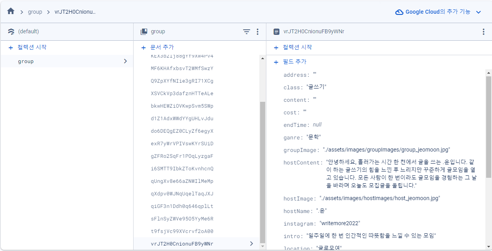
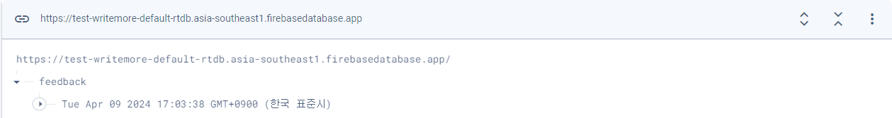
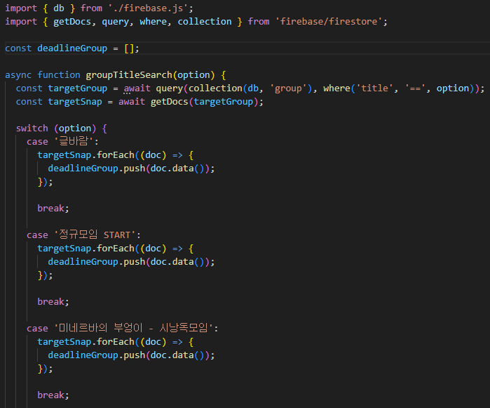
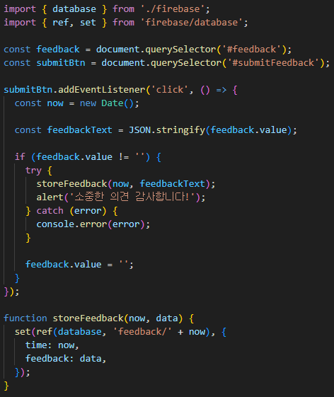
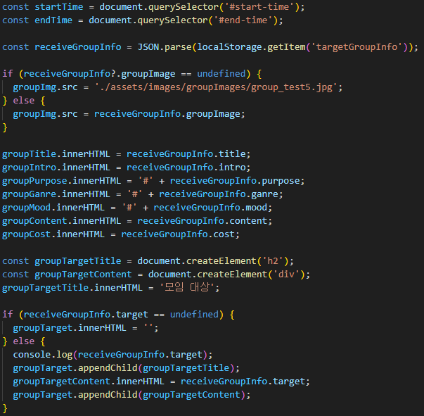

# 글로모여

## 프로젝트 URL

**https://test-writemore.web.app/**

Firebase Hosting을 통해 배포하였습니다.

## 기획 의도

대구광역시에서 진행되던 글 쓰기 및 독서 모임에 대한 정보를 통합하여 유저들에게 제공하며, 이를 통해 "글로모여"라는 키워드를 브랜딩하고자 했습니다.

## 프로젝트 기간

2023.03 ~ 2023.04 (6주)

## 개발 환경

- HTML5
- CSS3
- NodeJS 18.12.1
- Firebase v9
    - Firebase Hosting
    - Firebase Realtime Database
    - Firebase FireStore

## 프로젝트 내 역할

- CSS Media Query를 이용한 반응형 웹 UI 구현

    
    

 

- Firebase Firestore 및 Realtime Database을 통한 데이터 저장 및 조회 로직 구현

    
    

 

- DOM(Document Object Model) 인터페이스를 이용하여 동적 HTML 구현

- URL Query String 및 Local Storage를 이용한 데이터 조회 로직 구현

- webpack 모듈 번들러를 이용하여 웹 사이트 성능 향상
- Dotenv 라이브러리를 통한 환경 변수 설정
